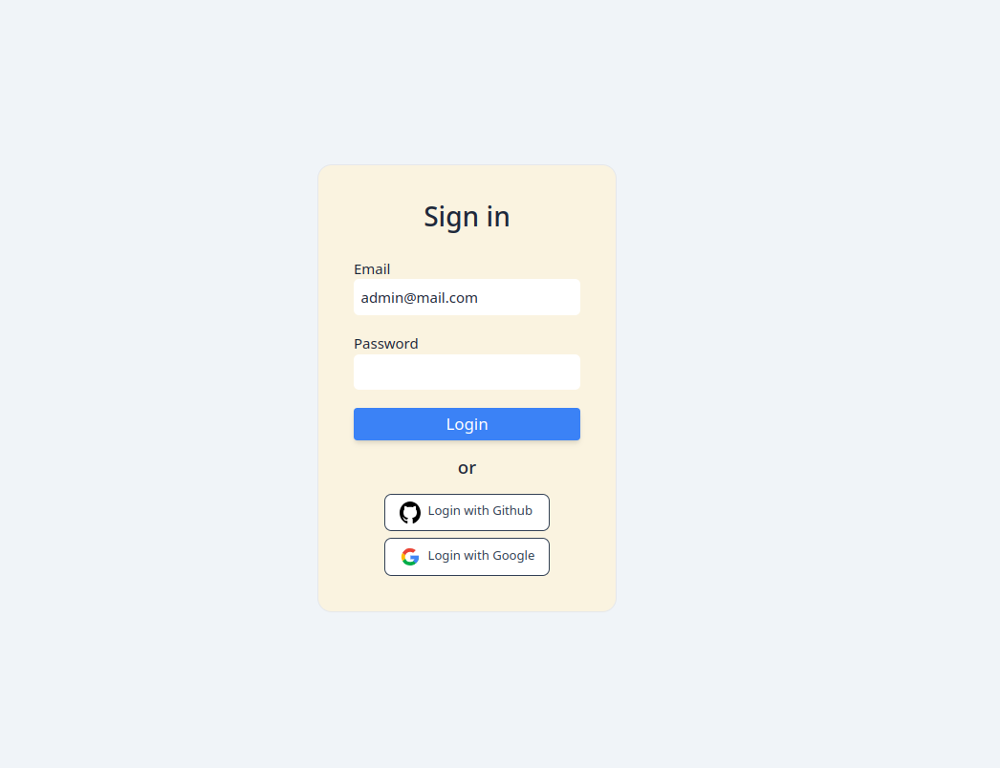
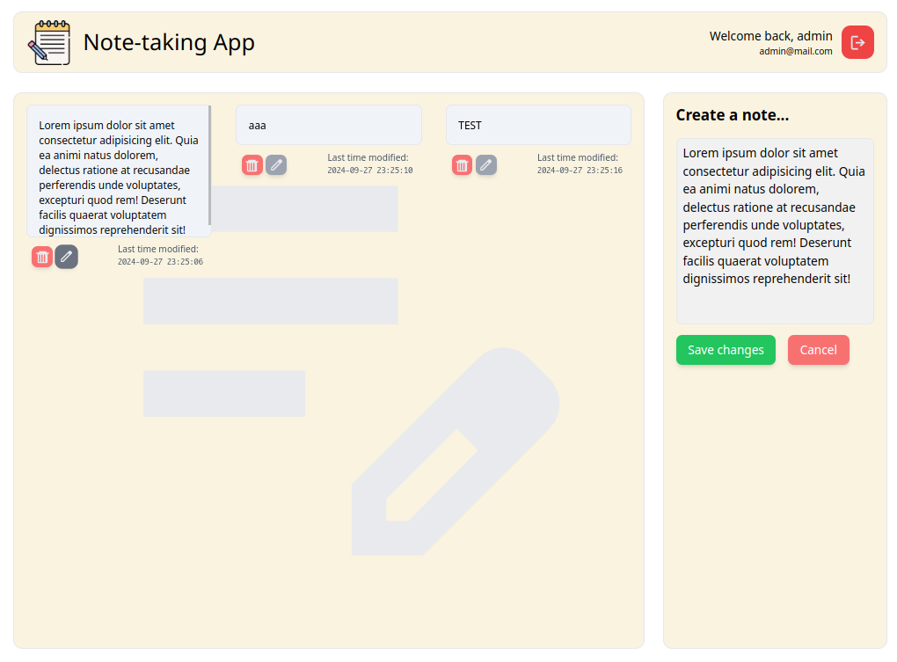
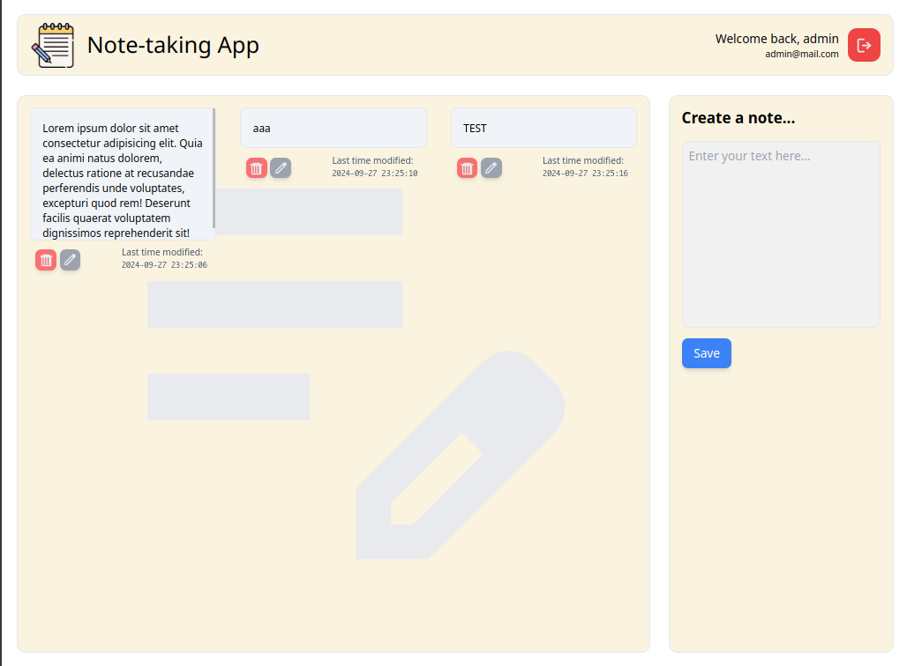

## Note App

CRUD operations, user authentication and responsive ui

- Next.js
- Tailwind css
- MySQL
- PHP
- NextAuth

Getting started:

1. Start mysql and web server with PHP interpreter
2. Host 'note-app' folder from backend directory
3. Import database from note-app.sql
4. Change username and password for mysql user in config.php if needed

```bash
npm install
npm run build
npm start
```

Open [http://localhost:3000](http://localhost:3000) with your browser to see the result.

## User accounts, authentication and login with feature



## Edit and delete functionality




## Responsive

